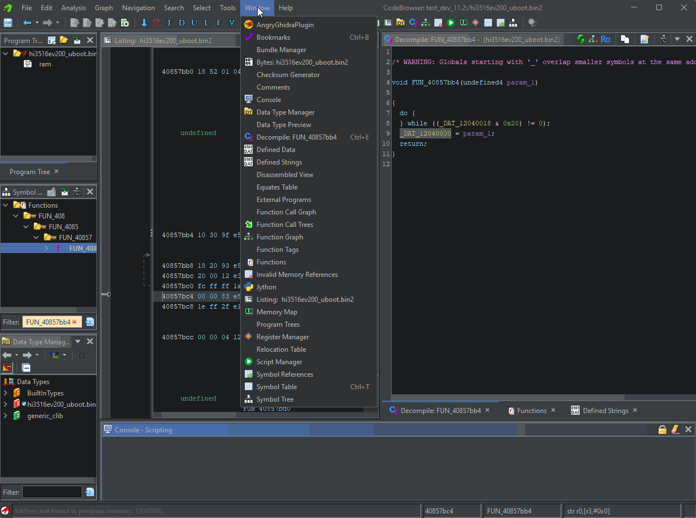

# Ghidra Invalid Memory Refs

  

This plugin allows you to list all references to undefined memory addresses.

This is useful for reversing firmware or drivers in early stages when determining memory mappings.

## Installing

This extension is available for installation via the [Ghidra Extension Manager](https://github.com/antoniovazquezblanco/GhidraExtensionManager).

You may also install this extension by going to the [releases page](https://github.com/antoniovazquezblanco/GhidraInvalidMemoryRefs/releases) and downloading the latest version for your Ghidra distribution. In order to install from the release, in Ghidra main window go to `File` > `Install extensions...`. In the new window press the `+` icon to import the downloaded zip.

## Usage

There will be a new window available in the CodeBrowser toolbar. This window can be opened by clicking on `Window` > `Invalid Memory References`. The window will list all invalid memory references.

## Development

For development instructions checkout [doc/Develop.md](doc/Develop.md).
